# codenext-go

## Create A New Unity Project

Create a new project, and name it "codenext-go"

<details>
  <summary> Pic </summary>
  
</details>


### Import the GoogleVR SDK

Go to Assets > Import Package > Custom Package and select the GoogleVRForUnity_1.100.1.unitypackage

<details>
  <summary> Pic </summary>
  
</details>

##### Deselect libs folder

Remember to scroll down to "Plugins", and deselect that pesky "libs" folder before clicking Import.

<details>
  <summary> Pic </summary>
  
</details>

### Set the Target Platform

Cool, now let's tell Unity that we will be building a Virtual Reality app for Android by setting the Target Platform.

* Go to File > Build Settings
* Select "Android"
* Click "Switch Platform"

<details>
  <summary> Pic </summary>
  
</details>

### Configure the Player Settings

Now, with the Build Settings window still open, click "Player Settings" and it will pop open.

<details>
  <summary> Pic </summary>
  
</details>

##### Other Settings

* Click "Other Settings"
* Change the Package Name to "com.YourName.CodeNextGo"
* Change the Minimum API Level to "Android 7.0 'Nougat' (API level 24)" 

<details>
  <summary> Pic </summary>
  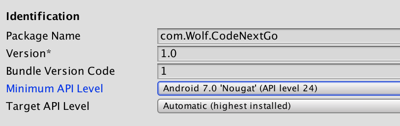
</details>

##### XR Settings

* Close "Other Settings" and Click "XR Settings"
* Select "Virtual Reality Supported"
* Click the "+" icon to add the "Cardboard" SDK

<details>
  <summary> Pic </summary>
  
</details>

## Creating the Ground

##### Add a cube

* Add a Cube GameObject to your scene, and name it "Ground"
* Set the position to x: 0, y: -1, z: 0
* Set the scale to x: 20, y: 1, z: 20

<details>
  <summary> Pic </summary>
  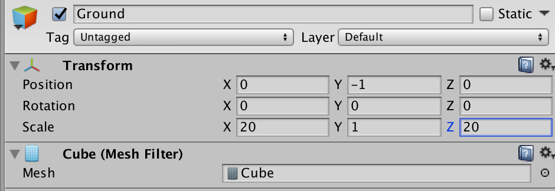
</details>

##### Your Ground should look like this
<details>
  <summary> Pic </summary>
  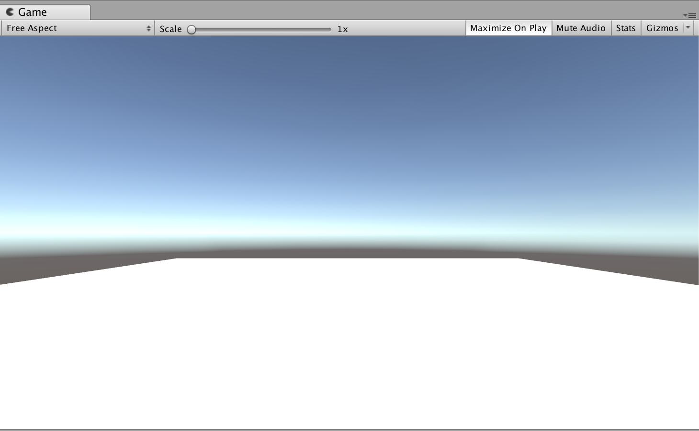
</details>

## Camera Setup

##### Create an empty GameObject and name it PlayerCamera

<details>
  <summary> Pic </summary>
  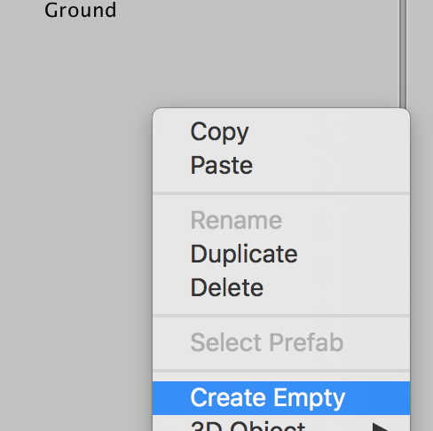
</details>

##### Drag the Main Camera into this PlayerCamera

<details>
  <summary> Pic </summary>
  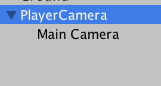
</details>

##### Add a RigidBody component to the PlayerCamera

<details>
  <summary> Pic </summary>
  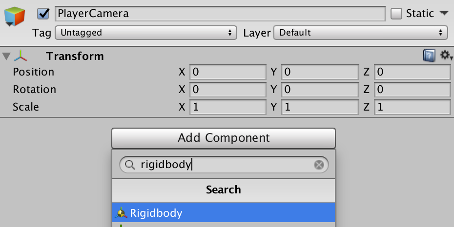
</details>

##### In the Rigidbody Contraints, Select X, Y, Z for Freeze Rotation

<details>
  <summary> Pic </summary>
  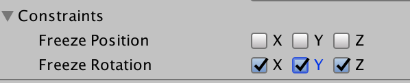
</details>

##### Add a Capsule Collider component to the PlayerCamera

<details>
  <summary> Pic </summary>
  
</details>

##### In the Capsule Collider, change the Center - Y value to -0.5
##### In the Capsule Collider, change the Height value to 1.5

<details>
  <summary> Pic </summary>
  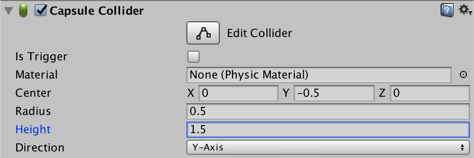
</details>

##### Move the PlayerCamera Y position to 2.28, and Z position to -9.46

<details>
  <summary> Pic </summary>
  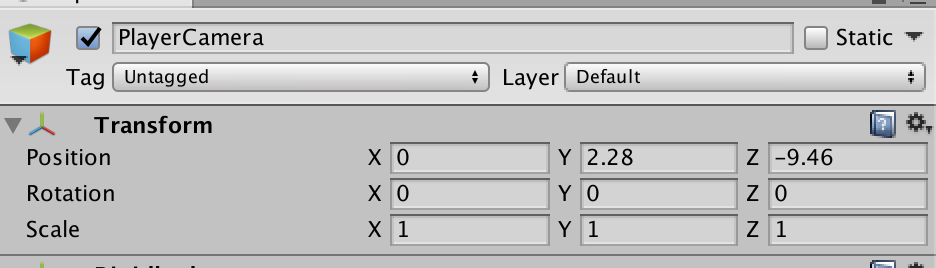
</details>

##### Move the Main Camera X, Y, and Z positions to (0, 0, 0)


<details>
  <summary> Pic </summary>
  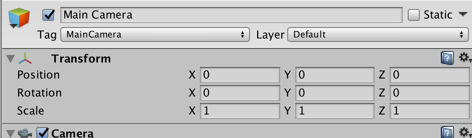
</details>

##### Your PlayerCamera should look like this
<details>
  <summary> Pic </summary>
  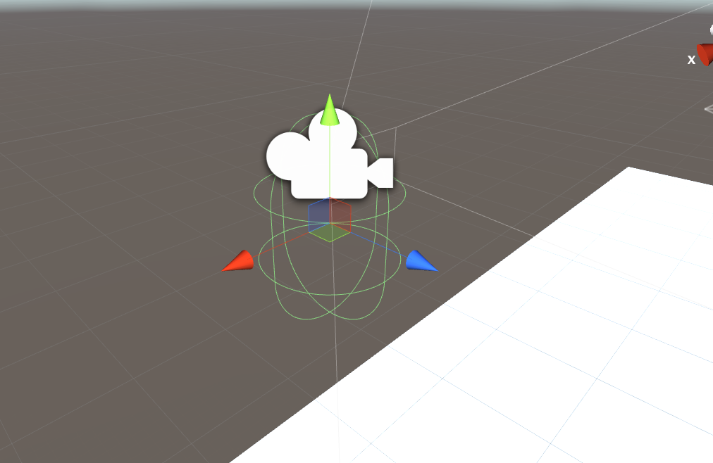
</details>

## Design the Pokeball (with Special Guest - Coach Wolf!)

## Spawn the Pokeball (with Special Guest - Coach Wolf!)

##### Create a folder called "Scripts"

<details>
  <summary> Pic </summary>
  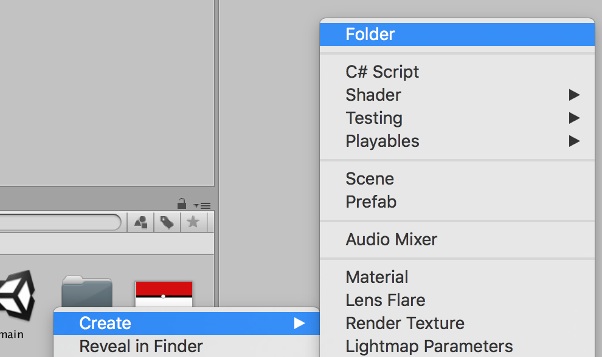
</details>

##### Create a C# Script in that Scripts folder called "WalkAndThrow"

<details>
  <summary> Pic </summary>
  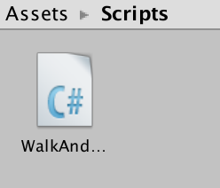
</details>

##### Open the WalkAndThrow script, and completely empty it

<details>
  <summary> Pic </summary>
  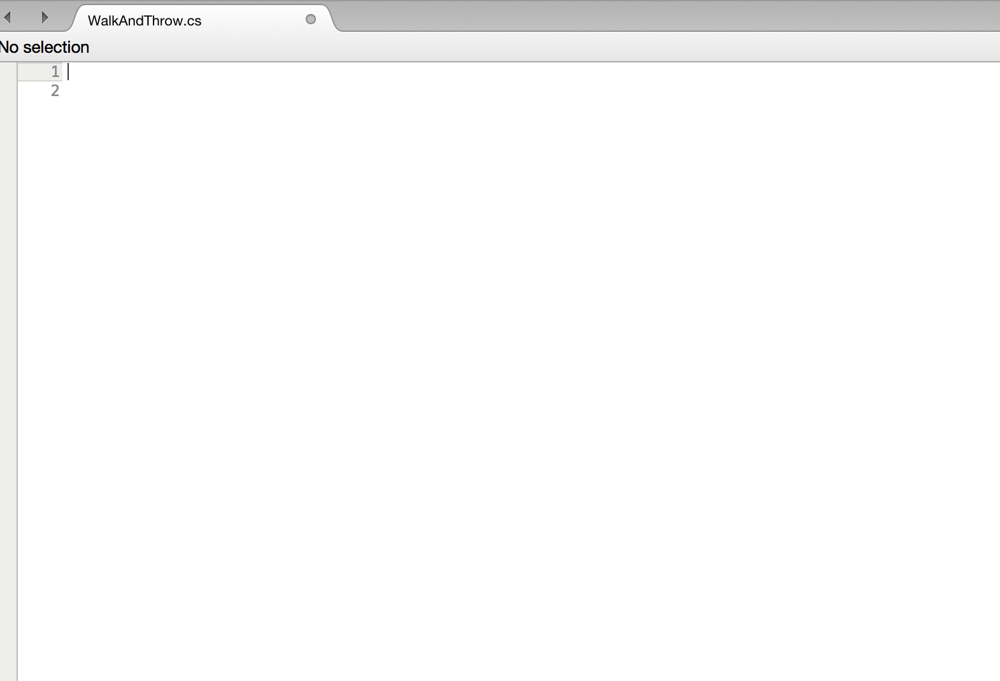
</details>

##### Copy and paste the following code into the script

````c#
using System.Collections;
using System.Collections.Generic;
using UnityEngine;

public class WalkAndThrow : MonoBehaviour {

	public GameObject pokeball;

	// Use this for initialization
	void Start () {
		
	}
	
	// Update is called once per frame
	void Update () {
		if (Input.GetButtonDown("Fire1")) {
			Instantiate(pokeball);
		}
	}
}
````

##### The WalkAndThrow Script should now look like this

<details>
  <summary> Pic </summary>
  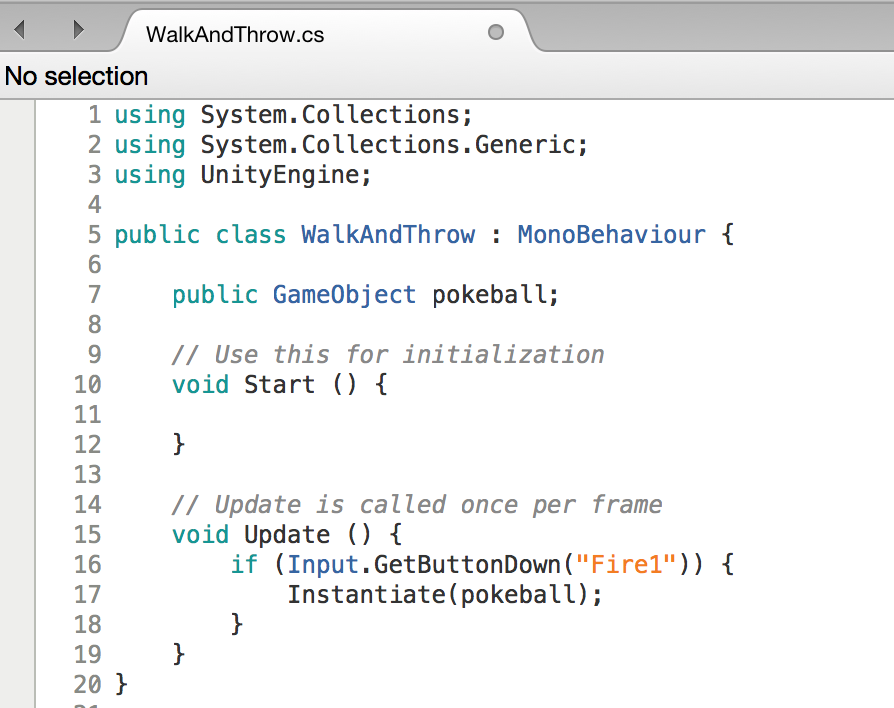
</details>

##### Drag the WalkAndThrow Script onto the PlayerCamera. Now, if you click on the PlayerCamera, you will see the Script component at the bottom

<details>
  <summary> Pic </summary>
  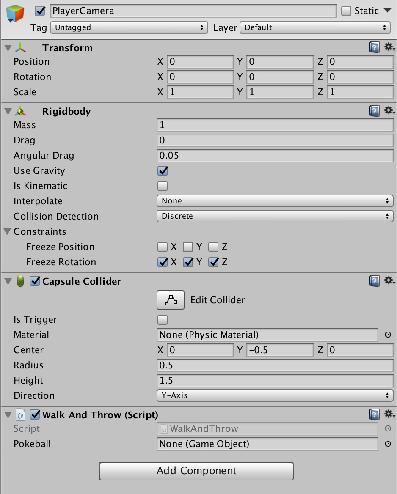
</details>

##### In that Script component, you will see a field named "Pokeball". Drag the Pokeball prefab we created onto this field

<details>
  <summary> Pic </summary>
  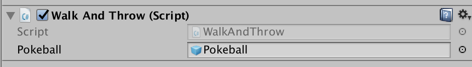
</details>

##### Delete the Pokeball GameObject from our hiearchy (our script will make it appear now)

<details>
  <summary> Pic </summary>
  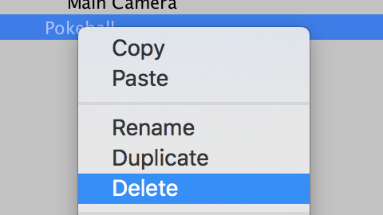
</details>


##### Now when you press play, and click the left mouse button ..... Pokeballs will appear!


<details>
  <summary> Pic </summary>
  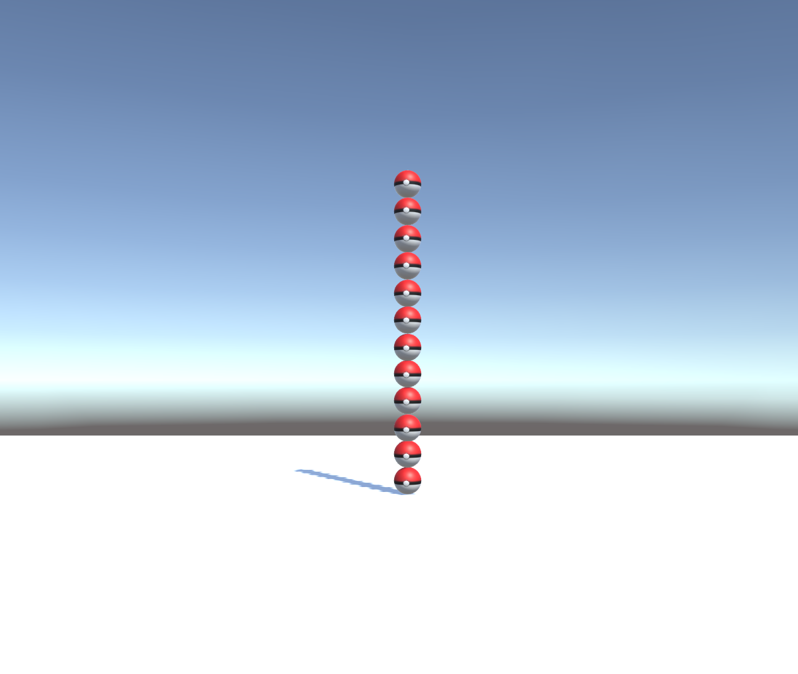
</details>

## Build Break (with Special Guest ..... Coach Wolf!! Again !!!)

##### Go to File > Build Settings and drag your scene into "Scenes in Build"

<details>
  <summary> Pic </summary>
  
</details>

##### Make sure your phone is on and plugged into your computer

##### Click "Build and Run" then save as "build0"

<details>
  <summary> Pic </summary>
  
</details>

##### The app should now play on your phone as a Cardboard app

## Throwing the Pokeball

##### On the PlayerCamera, change the Capsule Collider height to -1.1

<details>
  <summary> Pic </summary>
  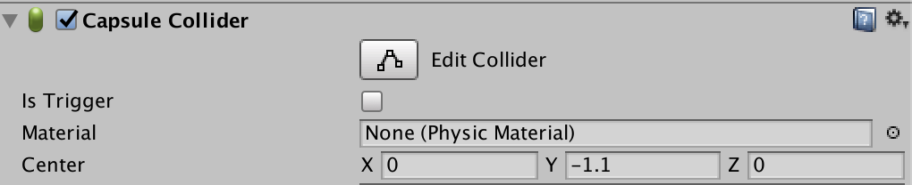
</details>

##### Open the WalkAndThrow script, and empty it again

<details>
  <summary> Pic </summary>
  
</details>

##### Copy and paste the following code into the WalkAndThrow script

````c#
using System.Collections;
using System.Collections.Generic;
using UnityEngine;

public class WalkAndThrow : MonoBehaviour {

	public GameObject pokeball;

	public float throwSpeed = 10;

	// Use this for initialization
	void Start () {

	}

	// Update is called once per frame
	void Update () {
		if (Input.GetButtonDown("Fire1")) {
			GameObject pokeGo = Instantiate(pokeball);
			pokeGo.transform.position = transform.position;
			Rigidbody rb = pokeGo.GetComponent<Rigidbody> ();
			Camera cam = GetComponentInChildren<Camera> ();
			rb.velocity = cam.transform.rotation * Vector3.forward * throwSpeed;
		}
	}
}
````

##### The WalkAndThrow script should now look like this. (Make sure to save it with CMD + S)

<details>
  <summary> Pic </summary>
  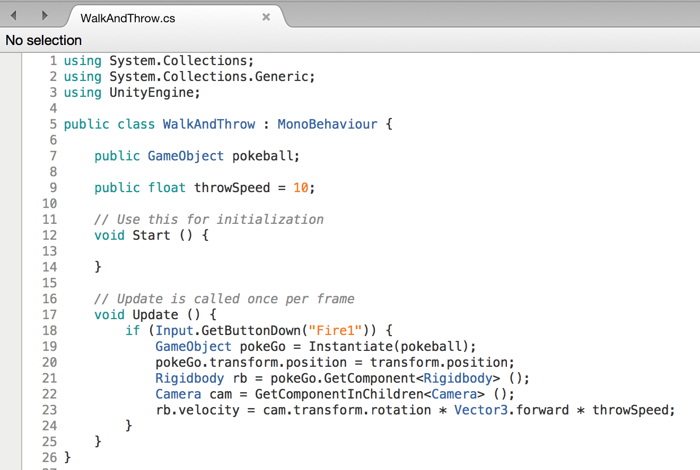
</details>

## Creating the Monsters

##### Go to the Asset Store and search for the "Level 1 Monster Pack"

<details>
  <summary> Pic </summary>
  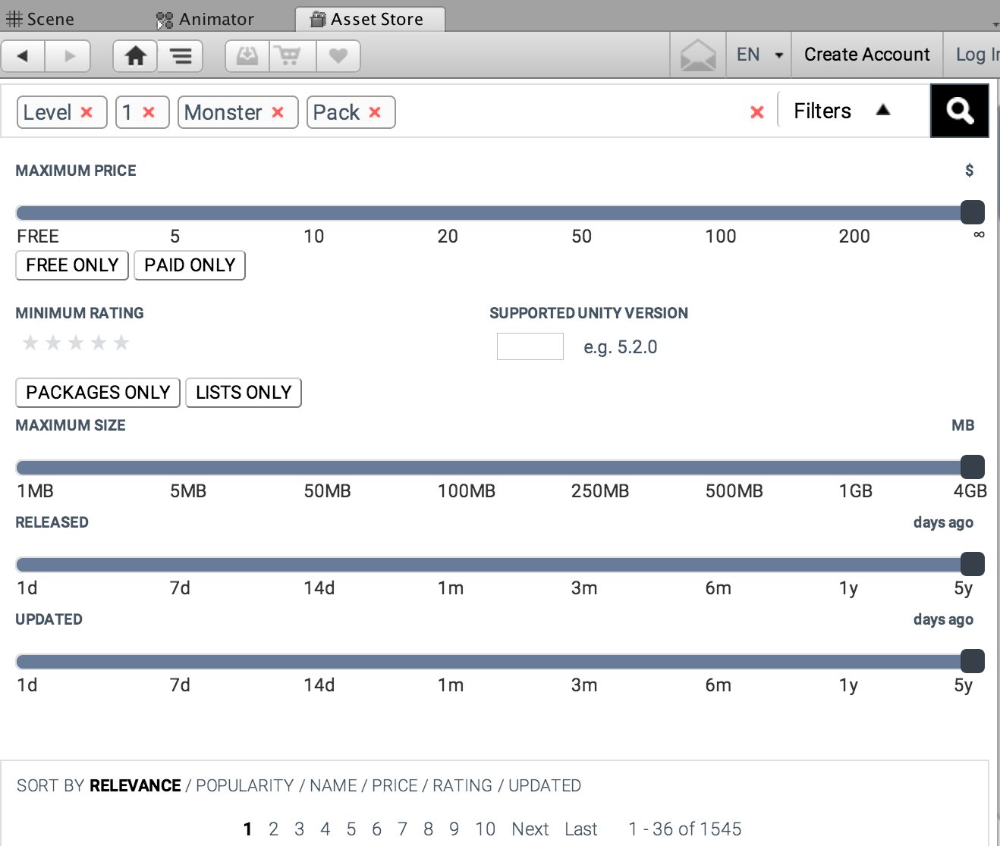
</details>

##### Click on the pack, Download, & Import the whole thang. NOTE: You may have to sign in with your Unity ID, try "Sign-in with Google"

<details>
  <summary> Pic </summary>
  
</details>

##### In the newly created Level 1 Monster Pack folder > Prefabs. You will see the following folders

<details>
  <summary> Pic </summary>
  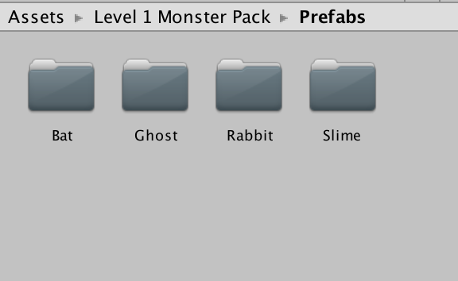
</details>

##### Open the Rabbit folder, and drag a Rabbit_Yellow into your scene


<details>
  <summary> Pic </summary>
  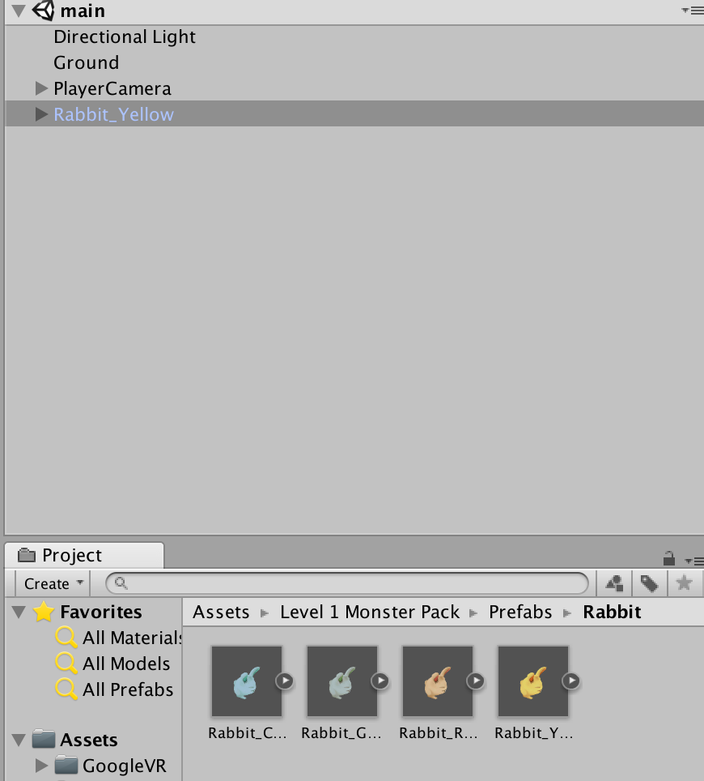
</details>

##### Change the scale of the Rabbit_Yellow to (35, 35, 35)
##### Change the rotation of the Rabbit_Yellow to (0, 180, 0)
##### Move the Rabbit_Yellow position in front of the camera (0, 0, -4)


<details>
  <summary> Pic </summary>
  
</details>

##### Add a Capsule Collider component to the Rabbit_Yellow

<details>
  <summary> Pic </summary>
  
</details>

##### Change the Capsule Collider "Center - Y", "Radius", and "Height" values to 0.01

<details>
  <summary> Pic </summary>
  
</details>

##### The Rabbit_Yellow should now look like this

<details>
  <summary> Pic </summary>
  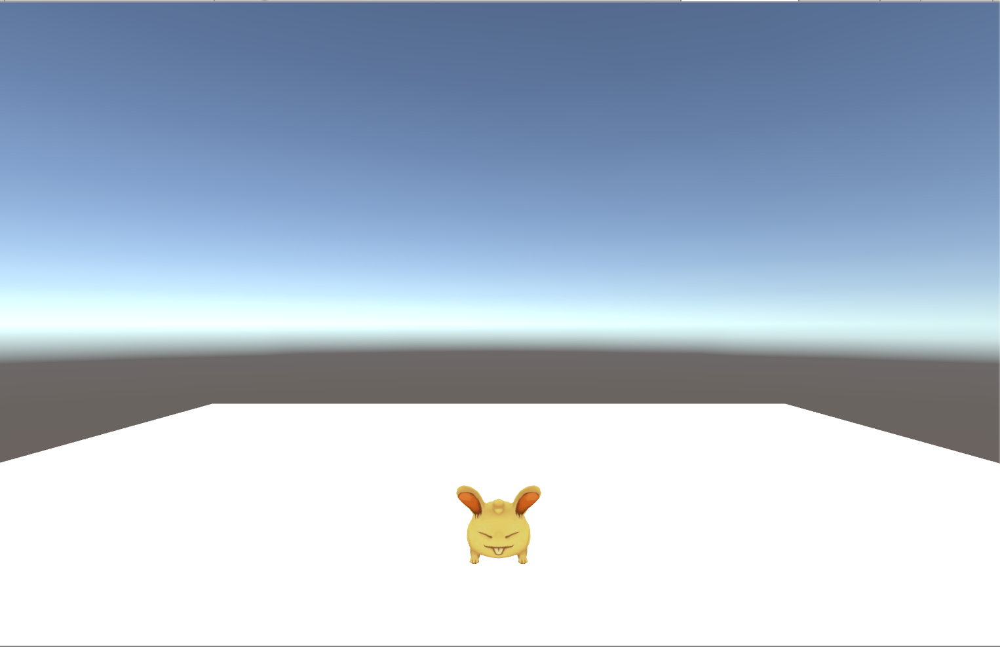
</details>

## Build Break!!


