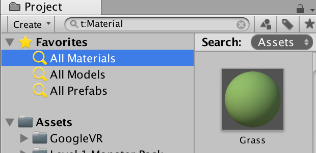
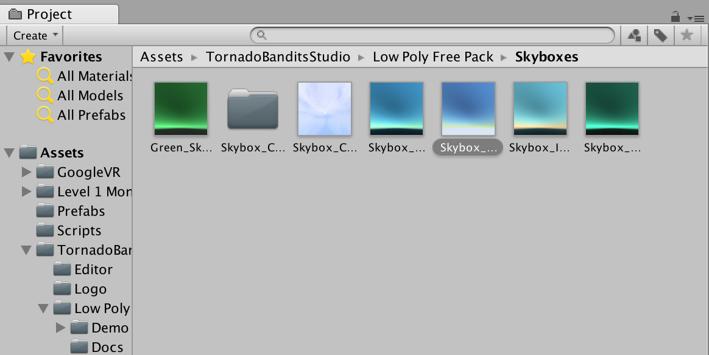

# codenext-go

## Create A New Unity Project

Create a new project, and name it "codenext-go"

<details>
  <summary> Pic </summary>
  
</details>


### Import the GoogleVR SDK

Go to Assets > Import Package > Custom Package and select the GoogleVRForUnity_1.100.1.unitypackage

<details>
  <summary> Pic </summary>
  
</details>

##### Deselect libs folder

Remember to scroll down to "Plugins", and deselect that pesky "libs" folder before clicking Import.

<details>
  <summary> Pic </summary>
  
</details>

### Set the Target Platform

Cool, now let's tell Unity that we will be building a Virtual Reality app for Android by setting the Target Platform.

* Go to File > Build Settings
* Select "Android"
* Click "Switch Platform"

<details>
  <summary> Pic </summary>
  
</details>

### Configure the Player Settings

Now, with the Build Settings window still open, click "Player Settings" and it will pop open.

<details>
  <summary> Pic </summary>
  
</details>

##### Other Settings

* Click "Other Settings"
* Change the Package Name to "com.YourName.CodeNextGo"
* Change the Minimum API Level to "Android 7.0 'Nougat' (API level 24)" 

<details>
  <summary> Pic </summary>
  
</details>

##### XR Settings

* Close "Other Settings" and Click "XR Settings"
* Select "Virtual Reality Supported"
* Click the "+" icon to add the "Cardboard" SDK

<details>
  <summary> Pic </summary>
  
</details>

## Creating the Ground

##### Add a cube

* Add a Cube GameObject to your scene, and name it "Ground"
* Set the position to x: 0, y: -1, z: 0
* Set the scale to x: 20, y: 1, z: 20

<details>
  <summary> Pic </summary>
  
</details>

##### Your Ground should look like this
<details>
  <summary> Pic </summary>
  
</details>

## Camera Setup

##### Create an empty GameObject and name it PlayerCamera

<details>
  <summary> Pic </summary>
  
</details>

##### Drag the Main Camera into this PlayerCamera

<details>
  <summary> Pic </summary>
  
</details>

##### Add a RigidBody component to the PlayerCamera

<details>
  <summary> Pic </summary>
  
</details>

##### In the Rigidbody Contraints, Select X, Y, Z for Freeze Rotation

<details>
  <summary> Pic </summary>
  
</details>

##### Add a Capsule Collider component to the PlayerCamera

<details>
  <summary> Pic </summary>
  
</details>

##### In the Capsule Collider, change the Center - Y value to -0.5
##### In the Capsule Collider, change the Height value to 1.5

<details>
  <summary> Pic </summary>
  
</details>

##### Move the PlayerCamera Y position to 2.28, and Z position to -9.46

<details>
  <summary> Pic </summary>
  
</details>

##### Move the Main Camera X, Y, and Z positions to (0, 0, 0)


<details>
  <summary> Pic </summary>
  
</details>

##### Your PlayerCamera should look like this
<details>
  <summary> Pic </summary>
  
</details>

## Design the Pokeball (with Special Guest - Coach Wolf!)

## Spawn the Pokeball (with Special Guest - Coach Wolf!)

##### Create a folder called "Scripts"

<details>
  <summary> Pic </summary>
  
</details>

##### Create a C# Script in that Scripts folder called "WalkAndThrow"

<details>
  <summary> Pic </summary>
  
</details>

##### Open the WalkAndThrow script, and completely empty it

<details>
  <summary> Pic </summary>
  
</details>

##### Copy and paste the following code into the script

````c#
using System.Collections;
using System.Collections.Generic;
using UnityEngine;

public class WalkAndThrow : MonoBehaviour {

	public GameObject pokeball;

	// Use this for initialization
	void Start () {
		
	}
	
	// Update is called once per frame
	void Update () {
		if (Input.GetButtonDown("Fire1")) {
			Instantiate(pokeball);
		}
	}
}
````

##### The WalkAndThrow Script should now look like this

<details>
  <summary> Pic </summary>
  
</details>

##### Drag the WalkAndThrow Script onto the PlayerCamera. Now, if you click on the PlayerCamera, you will see the Script component at the bottom

<details>
  <summary> Pic </summary>
  
</details>

##### In that Script component, you will see a field named "Pokeball". Drag the Pokeball prefab we created onto this field

<details>
  <summary> Pic </summary>
  
</details>

##### Delete the Pokeball GameObject from our hiearchy (our script will make it appear now)

<details>
  <summary> Pic </summary>
  
</details>


##### Now when you press play, and click the left mouse button ..... Pokeballs will appear!


<details>
  <summary> Pic </summary>
  
</details>

## Build Break (with Special Guest ..... Coach Wolf!! Again !!!)

##### Go to File > Build Settings and drag your scene into "Scenes in Build"

<details>
  <summary> Pic </summary>
  
</details>

##### Make sure your phone is on and plugged into your computer

##### Click "Build and Run" then save as "build0"

<details>
  <summary> Pic </summary>
  
</details>

##### The app should now play on your phone as a Cardboard app

## Throwing the Pokeball

##### On the PlayerCamera, change the Capsule Collider height to -1.1

<details>
  <summary> Pic </summary>
  
</details>

##### Open the WalkAndThrow script, and empty it again

<details>
  <summary> Pic </summary>
  
</details>

##### Copy and paste the following code into the WalkAndThrow script

````c#
using System.Collections;
using System.Collections.Generic;
using UnityEngine;

public class WalkAndThrow : MonoBehaviour {

	public GameObject pokeball;

	public float throwSpeed = 10;

	// Use this for initialization
	void Start () {

	}

	// Update is called once per frame
	void Update () {
		if (Input.GetButtonDown("Fire1")) {
			GameObject pokeGo = Instantiate(pokeball);
			pokeGo.transform.position = transform.position;
			Rigidbody rb = pokeGo.GetComponent<Rigidbody> ();
			Camera cam = GetComponentInChildren<Camera> ();
			rb.velocity = cam.transform.rotation * Vector3.forward * throwSpeed;
		}
	}
}
````

##### The WalkAndThrow script should now look like this. (Make sure to save it with CMD + S)

<details>
  <summary> Pic </summary>
  
</details>

## Creating the Monsters

##### Go to the Asset Store and search for the "Level 1 Monster Pack"

<details>
  <summary> Pic </summary>
  
</details>

##### Click on the pack, Download, & Import the whole thang. NOTE: You may have to sign in with your Unity ID, try "Sign-in with Google"

<details>
  <summary> Pic </summary>
  
</details>

##### In the newly created Level 1 Monster Pack folder > Prefabs. You will see the following folders

<details>
  <summary> Pic </summary>
  
</details>

##### Open the Rabbit folder, and drag a Rabbit_Yellow into your scene


<details>
  <summary> Pic </summary>
  
</details>

##### Change the scale of the Rabbit_Yellow to (35, 35, 35)
##### Change the rotation of the Rabbit_Yellow to (0, 180, 0)
##### Move the Rabbit_Yellow position in front of the camera (0, 0, -4)


<details>
  <summary> Pic </summary>
  
</details>

##### Add a Capsule Collider component to the Rabbit_Yellow

<details>
  <summary> Pic </summary>
  
</details>

##### Change the Capsule Collider "Center - Y", "Radius", and "Height" values to 0.01

<details>
  <summary> Pic </summary>
  
</details>

##### The Rabbit_Yellow should now look like this

<details>
  <summary> Pic </summary>
  
</details>

##### Change the Ground position to (0, -0.5, 0)

<details>
  <summary> Pic </summary>
  
</details>

##### Rename the Rabbit_Yellow to Rabbit_Yellow_Prefab

##### In the Inspector tab: under the name "Rabbit_Yellow_Prefab", click the dropdown next to "Tag" and choose "Add Tag"

<details>
  <summary> Pic </summary>
  
</details>

##### Under "Tags": click the "+" icon, name the tag "yellowrabbit", then press "Save"

<details>
  <summary> Pic </summary>
  
</details>

<details>
  <summary> Pic </summary>
  
</details>

##### Add the "yellowrabbit" tag to the "Rabbit_Yellow_Prefab"

<details>
  <summary> Pic </summary>
  
</details>


## Build Break!!

## More Monsters

##### Open the Slime folder, and drag a Slime_Red into your scene
##### Change the scale of the Slime_Red to (35, 35, 35)
##### Change the rotation of the Slime_Red to (0, 180, 0)
##### Move the Slime_Red position in front of the camera (-2, 0, -4)
##### Add a Capsule Collider component to the Slime_Red
##### Change the Capsule Collider "Center - Y", "Radius", and "Height" values to 0.01
##### Rename the "Slime_Red" to "Slime_Red_Prefab"
##### In the Inspector tab: under the name "Slime_Red_Prefab", click the dropdown next to "Tag" and choose "Add Tag"
##### Under "Tags": click the "+" icon, name the tag "redslime", then press "Save"
##### Add the "redslime" tag to the "Slime_Red_Prefab"

## Even More Monsters

##### Open the Ghost folder, and drag a Ghost_Violet into your scene
##### Change the scale of the Ghost_Violet to (35, 35, 35)
##### Change the rotation of the Ghost_Violet to (0, 180, 0)
##### Move the Ghost_Violet position in front of the camera (2, 0, -4)
##### Add a Capsule Collider component to the Ghost_Violet
##### Change the Capsule Collider "Center - Y", "Radius", and "Height" values to 0.01
##### Rename the "Ghost_Violet" to "Ghost_Violet_Prefab"
##### In the Inspector tab: under the name "Ghost_Violet_Prefab", click the dropdown next to "Tag" and choose "Add Tag"
##### Under "Tags": click the "+" icon, name the tag "violetghost", then press "Save"
##### Add the "ghostviolet" tag to the "Ghost_Violet_Prefab"

## Creating Monster Prefabs

##### Drag each Monster GameObject into YOUR Prefabs folder (not the one from the Level 1 Monsters Pack ---- (if this is confusing, call Coach Wolf)

<details>
  <summary> Pic </summary>
  
</details>

## Collecting the Monsters

##### Select EACH Monster prefab and, on EACH Capsule Collider, choose the "Is Trigger" option

<details>
  <summary> Pic </summary>
  
</details>

##### Create a new C# Script called "MonstersCollected"

<details>
  <summary> Pic </summary>
  
</details>

##### Open the "MonstersCollected" script, and completely empty it

<details>
  <summary> Pic </summary>
  
</details>

##### Copy and paste the following code into the MonstersCollected Script

````c#
using System.Collections;
using System.Collections.Generic;
using UnityEngine;

public class MonstersCollected : MonoBehaviour {

	// Use this for initialization
	void Start () {
		
	}
	
	public void OnTriggerEnter(Collider collider) {
		if (collider.gameObject.CompareTag ("violetghost")) {
			Destroy (collider.gameObject);
		}
		if (collider.gameObject.CompareTag ("yellowrabbit")) {
			Destroy (collider.gameObject);
		}
		if (collider.gameObject.CompareTag ("redslime")) {
			Destroy (collider.gameObject);
		}
	}
}
````

##### The MonstersCollectedScript should now look like this

<details>
  <summary> Pic </summary>
  
</details>

##### Click on the Pokeball prefab to open it in the Inspector view, then drag the MonstersCollected script on to the Pokeball

<details>
  <summary> Pic </summary>
  
</details>

## BUILD BREAK

##### At this point, when you throw a Pokeball at a Monster ----- the monster should disappear

## Keeping score

##### Create a new C# Script called "MonsterCalc"

<details>
  <summary> Pic </summary>
  
</details>


##### Open the "MonsterCalc" script, and completely empty it

<details>
  <summary> Pic </summary>
  
</details>

##### Copy and paste the following code into the "MonsterCalc" script

````c#
using System.Collections;
using System.Collections.Generic;
using UnityEngine;

public class MonsterCalc : MonoBehaviour {
	public int counter;

	// Use this for initialization
	void Start () {
		counter = 0;
	}
	
	// Update is called once per frame
	void Update () {
		
	}

	public void incrementCount() {
		counter = counter + 1;
	}
}
````

##### The "MonsterCalc" script should now look like this

<details>
  <summary> Pic </summary>
  
</details>

##### Create an empty GameObject in the Hiearchy, and name it "MonsterCalc"

<details>
  <summary> Pic </summary>
  
</details>

##### Drag the "MonsterCalc" script on to the "MonsterCalc" GameObject

<details>
  <summary> Pic </summary>
  
</details>

## Updating MonstersCollected and Destroying Pokeballs

##### Add a Tag to the Ground GameObject called "ground" (like you did the Monsters before)

<details>
  <summary> Pic </summary>
  
</details>

<details>
  <summary> Pic </summary>
  
</details>

<details>
  <summary> Pic </summary>
  
</details>

##### Open the "MonstersCollected" Script, and completely empty it (again)

<details>
  <summary> Pic </summary>
  
</details>

##### Copy and paste the following code into the "MonstersCollected" script

````c#
using System.Collections;
using System.Collections.Generic;
using UnityEngine;

public class MonstersCollected : MonoBehaviour {

	MonsterCalc monsterCalc;

	// Use this for initialization
	void Start () {
		monsterCalc = FindObjectOfType<MonsterCalc> ();
	}
	
	public void OnTriggerEnter(Collider collider) {
		if (collider.gameObject.CompareTag ("violetghost")) {
			Destroy (collider.gameObject);
			monsterCalc.incrementCount ();
			Destroy (gameObject);
		}
		if (collider.gameObject.CompareTag ("yellowrabbit")) {
			Destroy (collider.gameObject);
			monsterCalc.incrementCount ();
			Destroy (gameObject);
		}
		if (collider.gameObject.CompareTag ("redslime")) {
			Destroy (collider.gameObject);
			monsterCalc.incrementCount ();
			Destroy (gameObject);
		}
	}

	public void OnCollisionEnter(Collision collision) {
		if(collision.gameObject.CompareTag("ground")) {
			Destroy (gameObject);
		}
	}
		
}
````

## BUILD BREAK

##### When you throw a Pokeball, it should capture a Monster and disappear when it hits it or the ground

## Generating Monsters Randomly

##### Change the scale of your "Ground" to (200, 1, 200)

<details>
  <summary> Pic </summary>
  
</details>

##### Create a new C# script called "RandomMonsters"

<details>
  <summary> Pic </summary>
  
</details>

##### Open the "RandomMonsters" script, and completely empty it

<details>
  <summary> Pic </summary>
  
</details>

##### Copy and paste the following code into the "RandomMonsters" script

````c#
using System.Collections;
using System.Collections.Generic;
using UnityEngine;

public class RandomMonsters : MonoBehaviour {

	public GameObject[] monsters;

	// Use this for initialization
	void Start () {
		for (int i = 0; i < Random.Range(700,900); i++) {
			monsterCount ();
		}

	}
	
	// Update is called once per frame
	void Update () {
		
	}

	public void monsterCount() {
		int monsterIndex = Random.Range (0, monsters.Length);
		GameObject monster = Instantiate(monsters[monsterIndex]);
		monster.transform.parent = transform;
		monster.transform.localPosition = new Vector3 (Random.Range (-90, 90), 0.0f, Random.Range (-90, 90));
	}
}
````

##### The RandomMonsters Script should now look like this

<details>
  <summary> Pic </summary>
  
</details>


##### Create an empty GameObject, and name it "RandomMonsters"

<details>
  <summary> Pic </summary>
  
</details>

##### Change the position of the "RandomMonsters" GameObject to (0, 0, 0), and drag on the "RandomMonsters" script

<details>
  <summary> Pic </summary>
  
</details>

##### Select the "RandomMonsters" GameObject and, on the RandomMonsters script component, dropdown the "Monsters" field

<details>
  <summary> Pic </summary>
  
</details>

##### Enter "3" for the Size

<details>
  <summary> Pic </summary>
  
</details>

##### Drag a different Monster prefab into each "Element" slot

<details>
  <summary> Pic </summary>
  
</details>


##### Delete the Monsters from the Hiearchy

##### When you press play, a ton of monsters should now appear randomly all over the larger ground

## Walking

##### Open the "WalkAndThrow" script, and completely empty it

<details>
  <summary> Pic </summary>
  
</details>

##### Copy and paste the following code into the "WalkAndThrow" script

````c#
using System.Collections;
using System.Collections.Generic;
using UnityEngine;

public class WalkAndThrow : MonoBehaviour {

	public GameObject pokeball;

	public float throwSpeed = 10;
	public float walkSpeed = 2;

	// Use this for initialization
	void Start () {

	}

	// Update is called once per frame
	void Update () {

		transform.position = transform.position + Camera.main.transform.forward * walkSpeed * Time.deltaTime;
			
		if (Input.GetButtonDown("Fire1")) {
			GameObject pokeGo = Instantiate(pokeball);
			pokeGo.transform.position = transform.position;
			Rigidbody rb = pokeGo.GetComponent<Rigidbody> ();
			Camera cam = GetComponentInChildren<Camera> ();
			rb.velocity = cam.transform.rotation * Vector3.forward * throwSpeed;
		}
	}
}
````

##### The "WalkAndThrow" script should now look like this

<details>
  <summary> Pic </summary>
  
</details>

## BUILD BREAK

##### Your scene should now move in the direction you are facing

## Creating the environment

##### Go to the asset store and search for the "Low Poly Free Pack"

##### Download and Import the Low Poly Free Pack by Tornado Bandits Studio

<details>
  <summary> Pic </summary>
  
</details>

##### In the TornadoBanditsStudio/Low Poly Free Pack folder, go to Prefabs

##### In the (misspelled) Tress folder, drag a Tree_Palm_02 tree into the scene

##### In the Rocks folder, drag both a Rock_01 and a Rock_02 into the scene (Feel free to move these so they are more visible)

##### Click "All Models", and drag a Grass_02 into the scene 

<details>
  <summary> Pic </summary>
  
</details>

##### Click "All Materials", and drag the Grass material on to your Ground

<details>
  <summary> Pic </summary>
  
</details>

##### Create prefabs by dragging the Tree, Rocks, and Grass into YOUR prefabs folder

<details>
  <summary> Pic </summary>
  
</details>

##### In the Low Poly Free Pack, go to Skyboxes and drag a skybox into the sky of your Scene view

<details>
  <summary> Pic </summary>
  
</details>

##### Remove the environment prefabs from the scene

##### Create a new C# Script named "RandomForest", completely empty it, and paste the following:

````c#
using System.Collections;
using System.Collections.Generic;
using UnityEngine;

public class RandomForest : MonoBehaviour {

	public GameObject[] differentTreesRocks;
	public GameObject[] differentGrassRocks;

	// Use this for initialization
	void Start () {

		for (int i = 0; i < Random.Range(700, 800); i++) {
			spawnTreesRocks ();
		}

		for (int j = 0; j < Random.Range(1000, 1100); j++) {
			spawnGrassRocks ();
		}

	}

	// Update is called once per frame
	void Update () {

	}

	public void spawnTreesRocks() {

		int treesRocksIndex = Random.Range (0, differentTreesRocks.Length);
		GameObject randomTreesRocks = Instantiate (differentTreesRocks[treesRocksIndex]);
		randomTreesRocks.transform.parent = transform;
		randomTreesRocks.transform.localPosition = new Vector3 (Random.Range (-95, 95), 0.0f, Random.Range (-95, 95));
	}

	public void spawnGrassRocks() {

		int grassRocksIndex = Random.Range (0, differentGrassRocks.Length);
		GameObject randomGrassRocks = Instantiate (differentGrassRocks[grassRocksIndex]);
		randomGrassRocks.transform.parent = transform;
		randomGrassRocks.transform.localPosition = new Vector3 (Random.Range (-95, 95), 0.0f, Random.Range (-95, 95));
	}

}
````

##### Create an empty GameObject, name it RandomForest, set the position to (0, 0, 0), and drag the RandomForest script on to it

##### Click on the RandomForest GameObject, and it will now have the script attached

##### Make the Script component look like so:

<details>
  <summary> Pic </summary>
  
</details>


